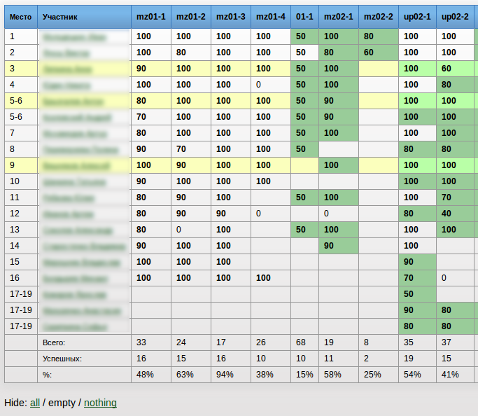

Добро пожаловать!
=================
В этом репозитории собраны [юзерскрипты](https://habrahabr.ru/post/129343/ "Что такое юзерскрипты, и пример создания своего скрипта") для браузеров, которые делают использование системы Ejudge удобнее.

Установка
---------
### Mozilla Firefox
1. Установите плагин [GreaseMonkey][1].
2. Выберите скрипт, который хотите установить, из списка ниже и нажмите ссылку "Установить".
3. После этого в диалоговом окне нажмите кнопку "Установить" / "Install".
Скрипт установлен, его работоспособность можно проверить, зайдя в свой Ejudge.

[1]: https://addons.mozilla.org/ru/firefox/addon/greasemonkey/

### Google Chrome / Chromium
1. Откройте новую вкладку.
2. Выберите скрипт, который хотите установить, из списка ниже и нажмите ссылку "Установить".
3. Вы получите сообщение, что скрипт не может быть установлен через данный сайт, однако *сам файл скрипта все равно скачается*.
4. Нажмите на стрелочку рядом со скачанным скриптом и выберите "Показать в папке" / "Show in folder". (Вы можете также просто найти папку с файлом через файловый менеджер.)
5. Перейдите по адресу chrome://extensions. (Введите в даресной строке и нажмите клавишу Enter.)
6. __Перетащите__ файл из файлового менеджера в браузер. Именно перетащите, комбинация *Сtrl-O* или другие способы __не__ работают.
7. Подветрдите установку расширения.

Вы также можете просто использовать какое-нибудь расширение для работы с пользовательскими скриптами — например, [TamperMonkey][1].

[1]: http://tampermonkey.net/

### Другие браузеры
Выполните действия, указанные [здесь](http://userscripts.ru/), или:

1. Скачайте поддерживаемый браузер.
2. Следуйте инструкциям по установке для поддерживаемых браузеров.

Обратите внимание, что обновление установленных скриптов *должно* происходить автоматически, однако рекомендуется периодически проверять репозиторий на наличие новых версий.

Разовый запуск
--------------
Если вы решили опробовать скрипт, но не хотите (пока) его устанавливать, вам достаточно скопировать полный код скрипта и вставить его в консоль вашего браузера. В большинстве современных браузеров консоль входит в состав инструментов разработчика, которые вызываются клавишей F12 для на PC и Cmd+Opt+J на Mac. Скрипт прекратит работать после обновления страницы.

-----

Описание доступных скриптов
---------------------------
### Highlight.js
Перерабатывает интерфейс таблицы результатов: подсвечивает выбранные строки, выделяя цветом досдачи в заивисмости от степени их выполнения; скрывает пустые и / или ненужные столбцы; считает дополнительную статистику среди досдач; превращает названия задач в заголовке таблицы в ссылки на соответствующие задания; позволяет произвольно сортировать строки — например, по имени участника. [Установить][2]

### Hide Unnecessary Problems
Скрывает решенные задачи в списке у правого края страницы. Учитываются задачи как решенные в машзале, так и в качестве домашнего задания. Также можно выбрать режим отображения всех задач. [Установить][3]

Все описания также доступны в самих скриптах в поле *@description* и будут отображаться при установке.

[2]: https://github.com/Facenapalm/Highlight.js/raw/master/highlight.user.js
[3]: https://github.com/Facenapalm/Highlight.js/raw/master/hide_unnecessary_tasks.user.js
