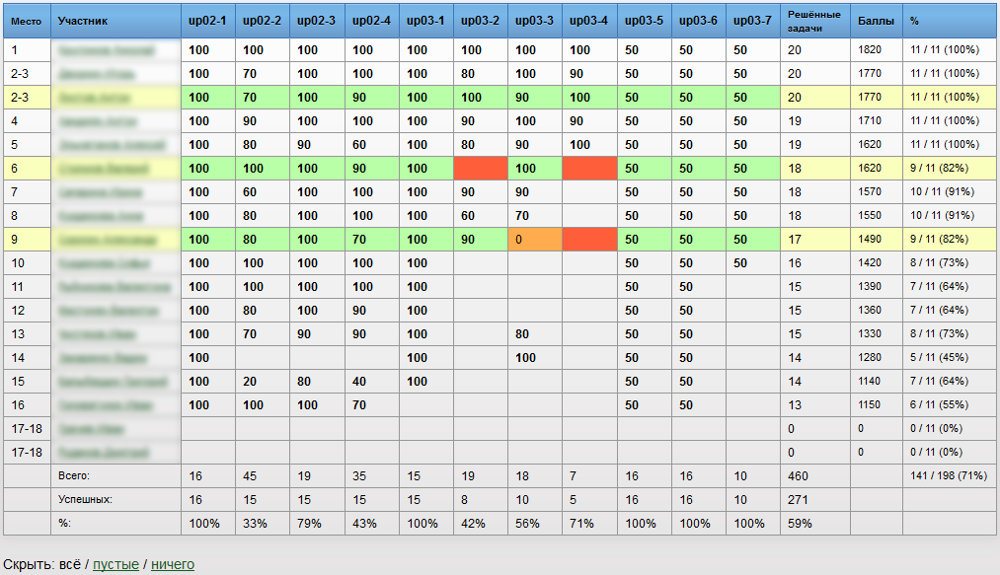
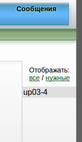
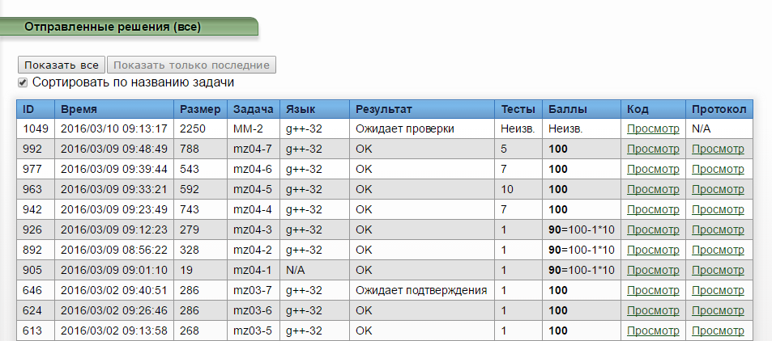
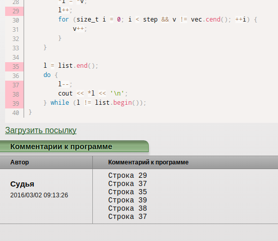

Добро пожаловать!
=================
В этом репозитории собраны [юзерскрипты](https://habrahabr.ru/post/129343/ "Что такое юзерскрипты, и пример создания своего скрипта") для браузеров, которые делают использование системы Ejudge удобнее.

Установка
---------
### Mozilla Firefox
1. Установите плагин [GreaseMonkey][1].
2. Выберите скрипт, который хотите установить, из списка ниже и нажмите ссылку «Установить».
3. После этого в диалоговом окне нажмите кнопку «Установить» / «Install».
Скрипт установлен, его работоспособность можно проверить, зайдя в свой Ejudge.

[1]: https://addons.mozilla.org/ru/firefox/addon/greasemonkey/

### Google Chrome / Chromium
1. Установите расширение [TamperMonkey][2].
2. Выберите скрипт, который хотите установить, из списка ниже и нажмите ссылку «Установить».
3. После этого в диалоговом окне нажмите кнопку «Установить» / «Install».
Скрипт установлен, его работоспособность можно проверить, зайдя в свой Ejudge.

Без установки расширения TamperMonkey это можно сделать так:

1. Откройте новую вкладку.
2. Выберите скрипт, который хотите установить, из списка ниже и нажмите ссылку «Установить».
3. Вы получите сообщение, что скрипт не может быть установлен через данный сайт, однако *сам файл скрипта все равно скачается*.
4. Нажмите на стрелочку рядом со скачанным скриптом и выберите «Показать в папке» / «Show in folder». (Вы можете также просто найти папку с файлом через файловый менеджер.)
5. Перейдите по адресу chrome://extensions. (Введите в адресной строке и нажмите клавишу Enter.)
6. __Перетащите__ файл из файлового менеджера в браузер. Именно перетащите, комбинация *Сtrl-O* или другие способы __не__ работают.
7. Подтветрдите установку расширения.

[2]: https://chrome.google.com/webstore/detail/tampermonkey/dhdgffkkebhmkfjojejmpbldmpobfkfo

### Другие браузеры
Выполните действия, указанные [здесь](http://userscripts.ru/), или:

1. Скачайте поддерживаемый браузер.
2. Следуйте инструкциям по установке для поддерживаемых браузеров.

Обратите внимание, что обновление установленных скриптов *должно* происходить автоматически, однако рекомендуется периодически проверять репозиторий на наличие новых версий.

Разовый запуск
--------------
Если вы решили опробовать скрипт, но не хотите (пока) его устанавливать, вам достаточно скопировать полный код скрипта, вставить его в консоль вашего браузера и нажать Enter. В большинстве современных браузеров консоль входит в состав инструментов разработчика, которые вызываются клавишей F12 на PC и сочетанием клавиш Cmd+Opt+J на Mac. Скрипт прекратит работать после обновления страницы или ухода с неё. Обратите внимание: вы должны открыть консоль в той вкладке, в которой у вас открыт Ejudge.

Кроме того, в некоторых консолях (например, в веб-инспекторе Mozilla Firefox) запрещена вставка кода (как возможная уязвимость). Разрешить ее можно, следуя указаниям браузера.

-----

Описание доступных скриптов
---------------------------
### Highlight.js
**[{Установить}][3]** Перерабатывает интерфейс таблицы результатов: подсвечивает выбранные строки, выделяя цветом досдачи в зависимости от степени их выполнения; скрывает пустые и / или ненужные столбцы; считает дополнительную статистику среди досдач; превращает названия задач в заголовке таблицы в ссылки на соответствующие задания; позволяет произвольно сортировать строки — например, по имени участника.

### Hide Unnecessary Problems
**[{Установить}][4]** Скрывает решенные задачи в списке у правого края страницы. Учитываются задачи как решенные в машзале, так и в качестве домашнего задания. Также можно выбрать режим отображения всех задач.

### Submissions Mod
**[{Установить}][5]** Перерабатывает интерфейс «Посылок»:
- расширяет таблицу так, чтобы каждая посылка занимала одну строку вместо двух;
- позволяет скрывать все посылки, кроме последних на каждую задачу;
- позволяет сортировать по названию задачи;
- визуально выделяет посылки на отдельные задачи.

### Highlight Lines
**[{Установить}][6]** Подсвечивает номера строк, упомянутых в комментарии к решению.

Все описания также доступны в самих скриптах в поле *@description* и будут отображаться при установке.

[3]: https://github.com/Facenapalm/Highlight.js/raw/master/highlight.user.js
[4]: https://github.com/Facenapalm/Highlight.js/raw/master/hide_unnecessary_tasks.user.js
[5]: https://github.com/YaLTeR/Highlight.js/raw/master/SubmissionsMod.user.js
[6]: https://github.com/YaLTeR/Highlight.js/raw/master/HighlightLines.user.js
